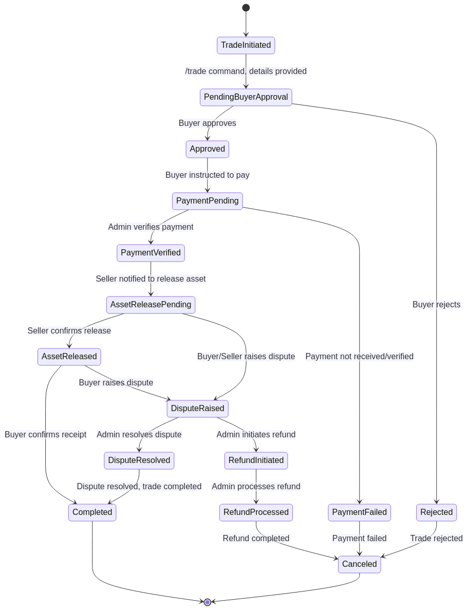

# Universal Telegram Escrow Bot

## Project Overview

The Universal Telegram Escrow Bot is designed to facilitate secure and trustworthy transactions between users on Telegram. It acts as a neutral third-party, holding funds in escrow until both the buyer and seller have fulfilled their agreed-upon obligations. This system is built to prevent fraud, ensure fair exchanges, and provide a reliable platform for peer-to-peer transactions within the Telegram ecosystem.

## Key Features

### Core Trade Flow
- **Trade Initiation**: Users can initiate a trade using the `/trade` command, guided through a conversation to specify item details.
- **Item Categorization**: Supports various item categories including Digital Assets, Crypto & Tokens, Services, Physical Goods, and Other.
- **Detailed Trade Specification**: Users can define price, currency, payment method, and a specific deadline for the trade.
- **Unique Trade ID**: Each trade is assigned a unique identifier for easy tracking.
- **Counterparty Approval**: Shareable trade links allow the counterparty (buyer) to review and approve or reject trade terms.
- **Fee Calculation**: Automatic calculation of escrow fees based on a tiered system (currently a flat 2.5%).
- **Payment Verification**: Admins can verify payments submitted by buyers.
- **Asset Release Confirmation**: Facilitates the confirmation of asset release upon successful payment verification.
- **Dispute Handling**: Basic framework for dispute initiation and resolution.

### Admin Features
- **Admin Identification**: Admins are identified via the `ADMIN_IDS` environment variable and can access special commands.
- **Payment Verification Interface**: Admins can verify payments for trades.
- **Force Release Option**: Admins can force the release of assets for unresponsive sellers.
- **Dispute Resolution Tools**: Admins have commands to mark disputes as resolved.
- **Daily Dashboard**: Provides a summary of daily trade statistics.
- **Full Trade History**: Admins can view a comprehensive history of all trades, with optional filtering.

### Refund Process
- **Manual Refund Initiation**: Users can initiate a refund request using the `/refund` command.
- **Admin Verification**: Admins are notified of refund requests and can verify them.
- **Refund Tracking**: Refund requests are tracked in the system.

### Technical Details
- **Database**: MongoDB for data persistence.
- **Timezone**: All time-related operations are handled in Nigeria Time Zone (WAT).
- **Deployment**: Designed for deployment on Koyeb.
- **Configuration**: Utilizes environment variables for sensitive configurations.

## How it Works (High-Level Flow)

1.  **Initiate Trade:** A user starts a trade using the `/trade` command.
2.  **Specify Item & Details:** The user is guided through a conversation to provide details about the item/service, price, currency, payment method, and deadline.
3.  **Counterparty Identification:** The user provides the Telegram ID or username of the counterparty (buyer).
4.  **Review & Confirm:** The bot summarizes the trade details, calculates fees, generates a unique Trade ID, and the initiator confirms.
5.  **Buyer Approval:** A shareable link is sent to the buyer for their approval or rejection of the trade terms.
6.  **Payment (Future Step):** Once approved, the buyer will be instructed to make payment and submit proof (this step requires further implementation).
7.  **Admin Verification (Future Step):** An admin will verify the payment proof.
8.  **Asset Release (Future Step):** Upon payment verification, the seller will be prompted to release the asset.
9.  **Dispute/Refund (if applicable):** If issues arise, a dispute can be raised, or a manual refund process initiated by the user (requiring admin approval).

## Deployment

This bot is designed for deployment on platforms like Koyeb. A detailed deployment guide is available:

*   [Koyeb Deployment Guide](koyeb_deployment_guide.md)

## Getting Started (Development)

To run this bot locally for development or testing:

1.  **Clone the repository:**
    ```bash
    git clone https://github.com/ekenegodwins22-eng/telegram-escrow-bot.git
    cd telegram-escrow-bot
    ```
2.  **Install dependencies:**
    ```bash
    pip install -r requirements.txt
    ```
3.  **Set up environment variables:**
    Create a `.env` file based on `.env.example` and replace `YOUR_BOT_TOKEN` with your actual Telegram Bot Token and `ADMIN_IDS` with the Telegram user IDs of your administrators.
    ```
    TELEGRAM_BOT_TOKEN=YOUR_BOT_TOKEN
    MONGODB_URI=mongodb://localhost:27017/
    ADMIN_IDS=123456789,987654321
    ```
4.  **Run the bot:**
    ```bash
    python3.11 main.py
    ```

## State Machine Diagram

The core logic of the trade flow is managed by a state machine, ensuring robust and predictable transitions between trade statuses. A visual representation of this state machine is provided below:



## Contributing

Contributions are welcome! Please feel free to fork the repository, make your changes, and submit a pull request.


## Development Roadmap (Completed/In Progress)

- [x] Complete the MongoDB integration (schemas for Users, Trades, Payments implemented).
- [x] Implement the full trade flow (conversation handlers, state transitions, basic fee calculation, buyer approval).
- [x] Develop admin features (dashboard, trade history, payment verification, force release, dispute resolution).
- [x] Implement the refund process (user initiation, admin verification).
- [x] Add comprehensive error handling.
- [ ] Deployment to Koyeb for testing (Configuration details provided in `koyeb_deployment_guide.md`).

