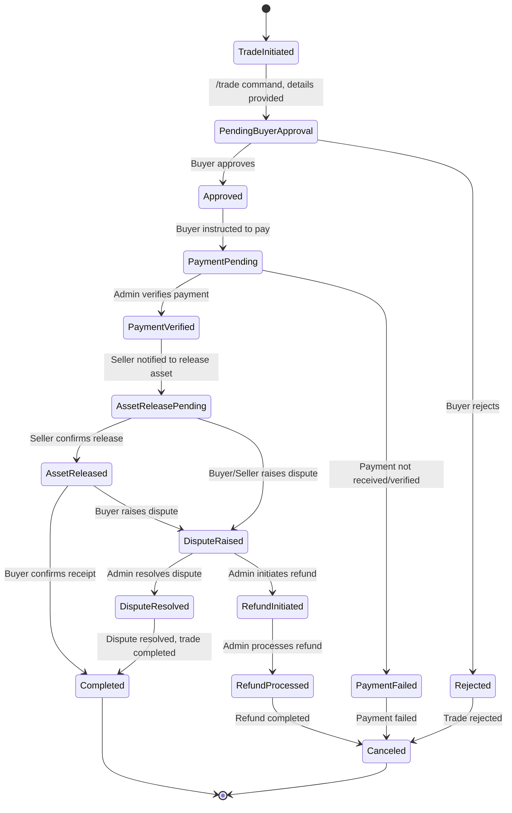

# Refined Bot Architecture and State Machine Flow

This document outlines the refined architecture and state machine flow for the Universal Telegram Escrow Bot, incorporating the existing codebase and addressing the comprehensive requirements.

## 1. Bot Architecture Overview

The bot's architecture is designed to be modular and scalable, leveraging Python for the Telegram bot logic, MongoDB for persistent data storage, and Flask for a lightweight web server to handle health checks and potential webhooks. The core components are:

*   **Telegram Bot (`python-telegram-bot`)**: Handles all interactions with Telegram users, including commands, conversations, and inline keyboard callbacks. It manages the user interface and guides users through trade initiation, approval, and other processes.
*   **MongoDB**: A NoSQL database used for storing all persistent data, including user profiles, trade details, payment records, and administrative logs. This ensures data integrity and persistence across bot restarts.
*   **Flask Web Server**: A minimal Flask application runs alongside the Telegram bot to provide a `/` endpoint for health checks. This is crucial for deployment platforms like Koyeb to ensure the application remains active and responsive.
*   **Environment Variables**: Configuration parameters such as `TELEGRAM_BOT_TOKEN`, `MONGODB_URI`, and `ADMIN_IDS` are managed via environment variables for security and flexibility.
*   **Time Zone Handling (`pytz`)**: All time-related operations are explicitly handled in the Nigeria Time Zone (WAT) to ensure consistency and accuracy for deadlines and timestamps.

## 2. Data Models (MongoDB Collections)

The bot utilizes three primary MongoDB collections to store its data:

### 2.1. `users` Collection

Stores information about Telegram users who interact with the bot.

| Field          | Type     | Description                                                              | Example                               |
| :------------- | :------- | :----------------------------------------------------------------------- | :------------------------------------ |
| `telegram_id`  | `int`    | Unique Telegram user ID.                                                 | `123456789`                           |
| `username`     | `string` | Telegram username (optional).                                            | `john_doe`                            |
| `first_name`   | `string` | User's first name.                                                       | `John`                                |
| `last_name`    | `string` | User's last name (optional).                                             | `Doe`                                 |
| `is_admin`     | `boolean`| `true` if the user is an admin, `false` otherwise.                       | `true`                                |
| `created_at`   | `datetime`| Timestamp of user registration (WAT).                                    | `2025-10-04 10:00:00+01:00`           |
| `updated_at`   | `datetime`| Timestamp of last update to user profile (WAT).                          | `2025-10-04 10:00:00+01:00`           |

### 2.2. `trades` Collection

Stores details about each escrow trade.

| Field               | Type       | Description                                                              | Example                               |
| :------------------ | :--------- | :----------------------------------------------------------------------- | :------------------------------------ |
| `trade_id`          | `string`   | Unique identifier for the trade (e.g., `TEB-00001`).                     | `TEB-00001`                           |
| `seller_id`         | `int`      | Telegram ID of the trade initiator (seller).                             | `123456789`                           |
| `buyer_id`          | `int`      | Telegram ID of the counterparty (buyer).                                 | `987654321`                           |
| `item_category`     | `string`   | Category of the item (e.g., `Digital Assets`, `Crypto & Tokens`).        | `Digital Assets`                      |
| `item_description`  | `string`   | Detailed description of the item.                                        | `1 BTC`                               |
| `price`             | `float`    | Agreed-upon price of the item.                                           | `50000.00`                            |
| `currency`          | `string`   | Currency of the trade (e.g., `USD`, `NGN`).                              | `USD`                                 |
| `payment_method`    | `string`   | Preferred payment method (e.g., `Bank Transfer`, `Crypto Wallet`).       | `Crypto Wallet`                       |
| `deadline`          | `datetime` | Deadline for trade completion (WAT).                                     | `2025-10-05 18:00:00+01:00`           |
| `status`            | `string`   | Current status of the trade (see State Machine below).                   | `pending_buyer_approval`              |
| `fee_amount`        | `float`    | Calculated escrow fee.                                                   | `1250.00`                             |
| `fee_currency`      | `string`   | Currency of the fee.                                                     | `USD`                                 |
| `payment_proof_url` | `string`   | URL to payment proof (if provided by buyer).                             | `https://example.com/proof.jpg`       |
| `dispute_status`    | `string`   | Status of any dispute (`none`, `raised`, `resolved`).                    | `none`                                |
| `created_at`        | `datetime` | Timestamp of trade creation (WAT).                                       | `2025-10-04 10:00:00+01:00`           |
| `updated_at`        | `datetime` | Timestamp of last update to trade status (WAT).                          | `2025-10-04 10:00:00+01:00`           |

### 2.3. `payments` Collection

(Currently not explicitly used in `main.py` for separate payment records, but can be extended for detailed payment tracking).

## 3. State Machine Flow

The bot employs a state machine approach to manage the lifecycle of each trade, ensuring a structured and predictable flow. The states and transitions are as follows:

**Explanation of States:**

*   **`TradeInitiated`**: The initial state when a user starts the `/trade` conversation and provides basic details.
*   **`PendingBuyerApproval`**: The trade details are summarized, and a link is sent to the buyer for their approval or rejection.
*   **`Approved`**: The buyer has reviewed and approved the trade terms.
*   **`Rejected`**: The buyer has rejected the trade terms, leading to cancellation.
*   **`PaymentPending`**: The buyer has approved the trade and is now expected to make the payment and submit proof.
*   **`PaymentVerified`**: An admin has successfully verified the buyer's payment proof.
*   **`PaymentFailed`**: The payment was not verified or received within the deadline, leading to cancellation.
*   **`AssetReleasePending`**: The seller is notified that payment is verified and is prompted to release the asset.
*   **`AssetReleased`**: The seller has confirmed the release of the asset.
*   **`Completed`**: The buyer has confirmed receipt of the asset, and the trade is successfully concluded.
*   **`DisputeRaised`**: Either the buyer or seller has raised a dispute regarding the trade.
*   **`DisputeResolved`**: An admin has intervened and resolved the dispute.
*   **`RefundInitiated`**: An admin has initiated a refund process.
*   **`RefundProcessed`**: The refund has been successfully processed.
*   **`Canceled`**: The trade has been canceled due to rejection, payment failure, or other reasons.

**Key Transitions and Responsibilities:**

*   **Trade Initiation**: Handled by the seller using the `/trade` command, leading to `PendingBuyerApproval`.
*   **Buyer Approval/Rejection**: Handled by the buyer via inline keyboard buttons, transitioning to `Approved` or `Rejected`.
*   **Payment Submission**: (Future implementation) Buyer submits payment proof, transitioning to `PaymentPending`.
*   **Payment Verification**: Admin action, transitioning to `PaymentVerified` or `PaymentFailed`.
*   **Asset Release**: Seller action, transitioning to `AssetReleased`.
*   **Buyer Confirmation**: Buyer action, transitioning to `Completed`.
*   **Dispute Handling**: Admin action, transitioning to `DisputeResolved` or `RefundInitiated`.
*   **Refund Processing**: Admin action, transitioning to `RefundProcessed`.

## 4. Areas for Refinement and Expansion

Based on the initial analysis, the following areas require further development or refinement to meet the comprehensive requirements:

*   **Payment Submission and Proof**: The current `main.py` code initiates the trade and notifies the buyer but lacks the explicit mechanism for the buyer to submit payment proof (e.g., an image or URL). This needs to be implemented as a new conversation step or command.
*   **Admin Payment Verification Interface**: While the `koyeb_deployment_guide.md` mentions admins can verify payments, the `main.py` code does not yet expose a clear admin command or interface for this. This needs to be developed.
*   **Force Release Option**: The requirement for admins to 

force release assets for unresponsive sellers is mentioned, but the implementation is missing.
*   **Dispute Resolution Tools**: The current code has a `dispute_status` field but lacks concrete commands or handlers for admins to manage and resolve disputes.
*   **Daily Dashboard and Full Trade History**: Admin features for a daily dashboard with trade statistics and a full trade history view are mentioned but not implemented in `main.py`.
*   **Refund Process Completion**: While `refund_reason` is a state, the full refund process with admin verification and processing needs to be fleshed out.
*   **Error Handling and Robustness**: Enhance error handling, especially for MongoDB operations and Telegram API calls, to make the bot more resilient.
*   **Concurrency and Threading**: The current `main.py` uses `threading.Thread` for the bot and Flask app. While this works, ensuring proper synchronization and avoiding race conditions, especially with shared MongoDB client, needs careful consideration. `python-telegram-bot`'s `Application.run_polling()` is asynchronous, and running Flask in a separate thread might have implications for how `asyncio` is managed.
*   **F-string and Nested Quotes**: Pay attention to f-string syntax, especially when constructing complex messages with nested quotes, to avoid `SyntaxError`.
*   **Koyeb Health Checks**: The Flask app provides a basic health check. Ensure it's robust enough for Koyeb's requirements.

This refined architecture and state machine provide a clear roadmap for further development and refinement of the Telegram Escrow Bot.
